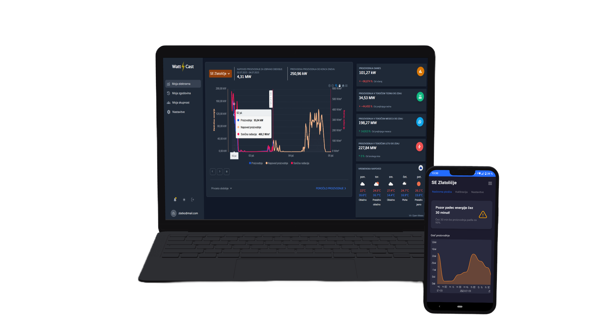
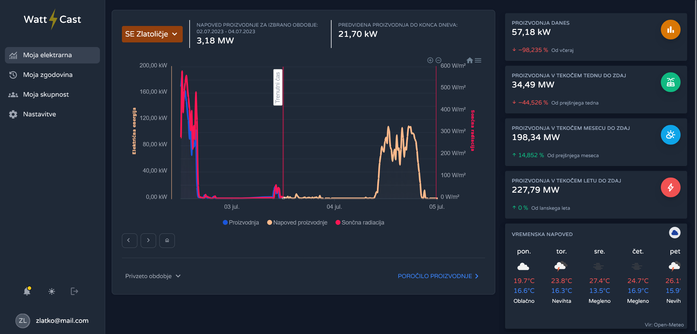
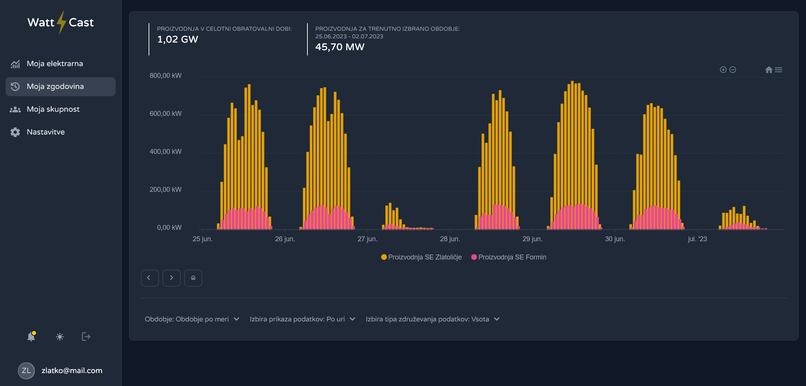

<h1 align="center">
    Watt4Cast
</h1>

<h4 align="center">
A powerful and user-friendly application for forecasting solar energy production.
</h4>

    
    

## Vision

An intelligent way to forecast the power generation of a home solar power systems. Overview and control of data at your fingertips.

An app designed for green power plant owners and organisations who want a better overview of their electricity production statistics. With the help of advanced technologies, we can forecast the production of different solar power plants. Our services provide an accurate and flexible overview of the data, both retrospectively and prospectively.

## Core features

-   A `forecasting model` to predict the production of solar power plants
-   Overview of power plant `production history` with graphs and customisable data aggregation
-   Connecting power plants into `energy communities`

## Build with

## App overview

    

    

